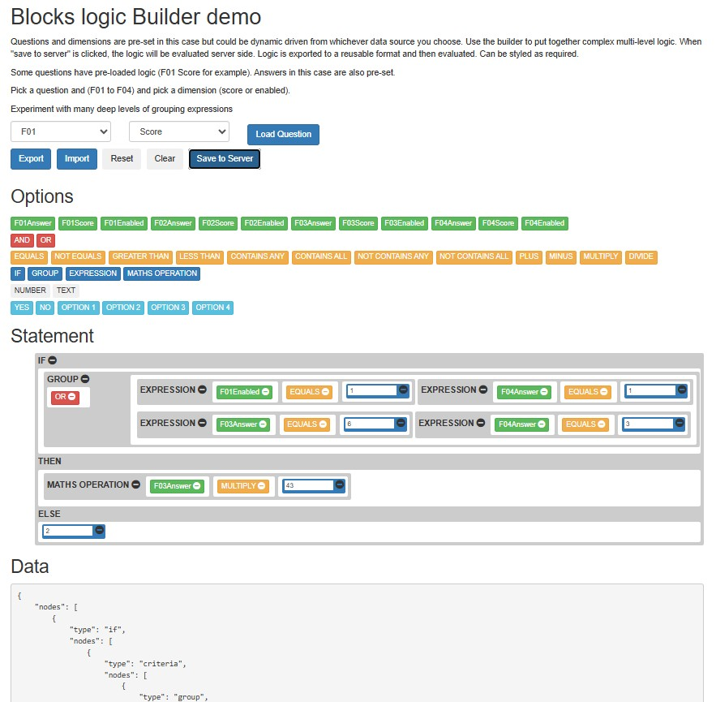
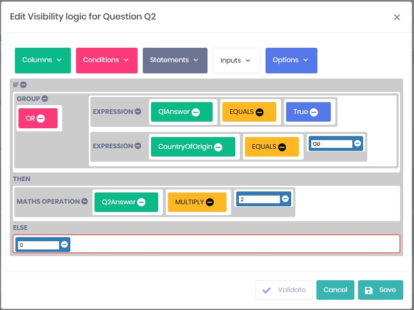

# LogicalExpressionBuilder
- Is a tool for building logical expressions. Two components, a web UI and server side interpreter.
- Can create and manage complex logical expressions using a simple and intuitive point and click mechanism. 
- Export expressions to a format that can then be evaluated by the server side interpreter, current implementation transforms expressions to a format that can be evaluated by DataTable Column Expressions.
- Logic can be re-loaded from storage and exported back to storage
- Builder web UI is template based, allowing you to defined your own logical expressions
- Supports multiple levels of logical expression

# Web UI
- Attempts to make construction and management of complex logical expressions available through a simple user interface
- Available options presented by the tool adjusted depending on context to help reduce information overload for the end user
- No limit of expression depth
- Not limited to boolean outcomes like many predicate builders, outcome can be any type, making this useful for not only predicates but evaluating scoring or other algorithms

# Server side interpreter
- Could be tailored for other uses but currently built using DataTables, expressions evaluated by Column DataExpressions
- DataTable constructed dynamically based on the available layers of questions, sections, dimensions

# Installation
This is just a repo containing a demo website to run an example of the tool. Clone the repo and run it.

# Demo
- See here for a running version of this demo: https://nvelop.co.uk/logical-expression-builder/

# Screen shots

This demo running in a browser:

Web UI styling example:

